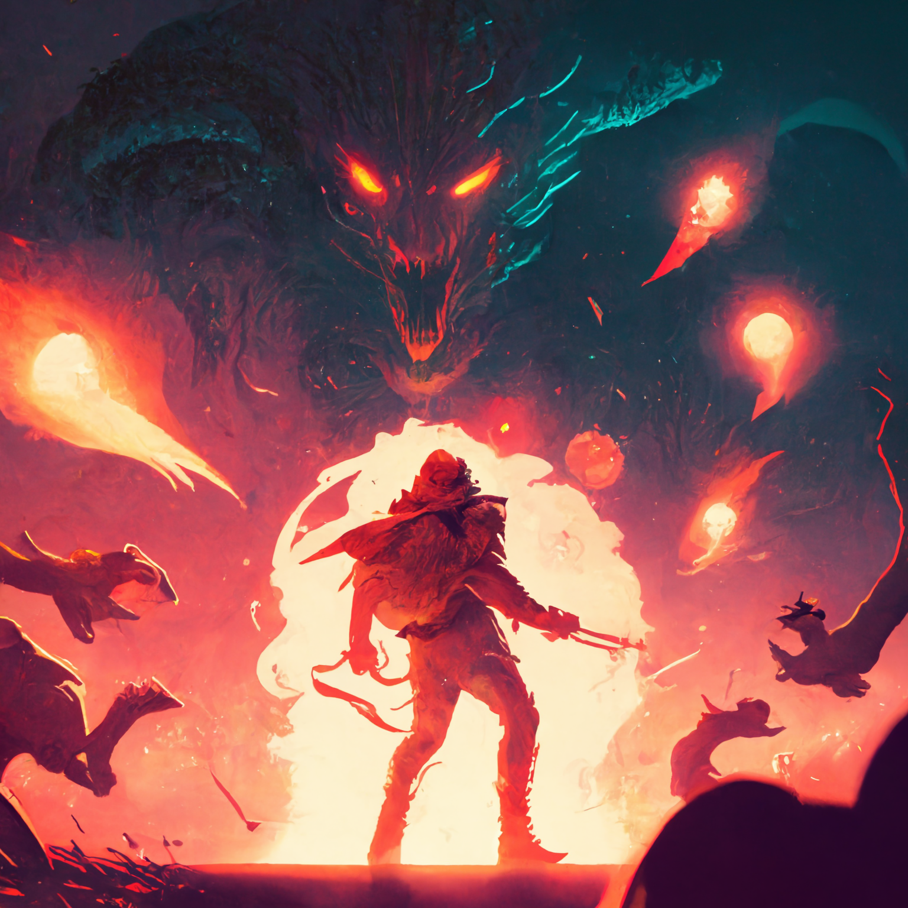
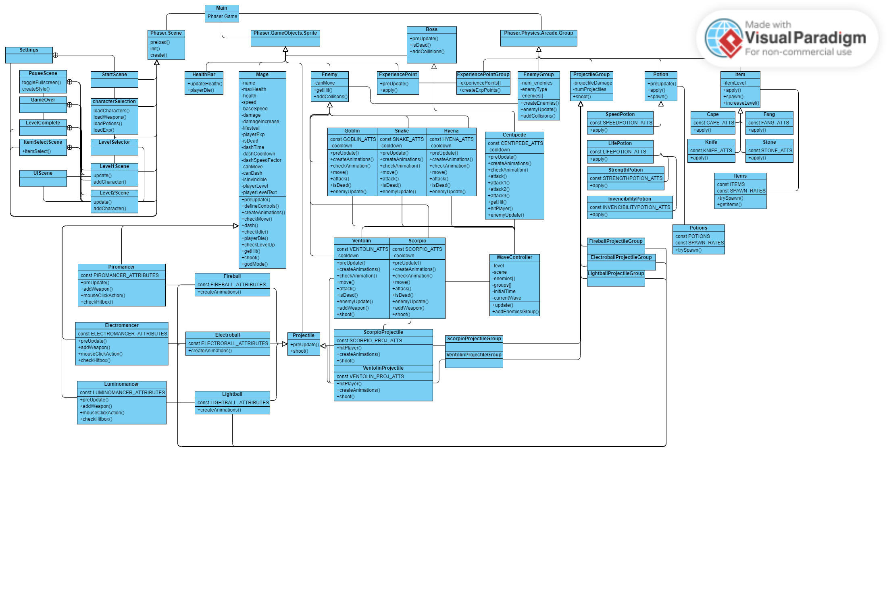

# Folklore Hunters

Folklore Hunters es un videojuego desarrollado para la asignatura Desarrollo de Videojuegos mediante Tecnologías Web de la Universidad Complutense de Madrid (UCM) durante el curso 2022-23.

  

## Descripción del proyecto

Este videojuego está desarrollado con el framework de Phaser3 y está pensado para jugarse en un navegador web.

El juego está ambientado en la mitología española, temática que debemos seguir este curso, y cuenta con enemigos, escenarios y objetos basados en distintos mitos del folclore ibérico.

## Capturas del juego/bocetos

  

## Enlace al juego

[Folklore Hunters](https://castrodaniel18.github.io/DVI/)

  

# Arquitectura del juego

La arquitectura del juego se puede ver en el siguiente archivo UML

  

  

# Folklore Hunters

#### *Visual Studio Games*

#### Miguel Zayas Boíza, Daniel Castro López, Iulius Gherasim, Rogger Huayllasco de la Cruz

## **Documento de diseño**

  

# 1. Información básica

  

- Título: Folklore Hunters

- Género: Shooter por oleadas, Roguelike

- Plataforma: Web

- Audiencia objetivo: Casual

  

## 1.1 Descripción

Este juego consiste en un shooter por oleadas en el que el jugador tendrá que sobrevivir y matar la mayor cantidad de enemigo posibles para poder enfrentarse al jefe del nivel y poder pasar a la siguiente zona.

Al derrotar enemigos el jugador irá obteniendo experiencia con la que podrá subir de nivel. Cada vez que suba de nivel tendrá la posibilidad de elegir entre tres objetos aleatorios que le proporcionarán una mejora permanente durante toda la partida. Además, también podrá obtener mejoras recogiendo objetos que habrá esparcidos por el mapa, solo que estos tendrán un efecto temporal.

El objetivo final del juego será recorrer todas las zonas del mapa derrotando el mayor número de enemigos posibles para hacerse lo suficientemente fuerte para derrotar a todos los jefes finales y salvar el mundo.

  

## 1.2 Ambientación

El escenario que se plantea en el juego es que el jugador es un cazador que se ha encontrado con que todo el país ha sido invadido por seres mitológicos que hasta ahora ni siquiera se sabía si existían realmente. Nuestro protagonista tomará el papel del héroe que va a salvar a todo el país, recorriendo cada región de España para derrotar a todos los monstruos. En cada región se encontrará con seres mitológicos típicos de esa región y, cuando haya acabado con suficientes monstruos débiles, obligará a aparecer al jefe, que en cada región será uno de los seres mitológicos más conocidos de esa región.

Del mismo modo, tanto los objetos que pueda recoger del suelo, como los objetos que el personaje obtiene al subir de nivel, serán objetos basados en la mitología de España.

  

# 2. Jugabilidad

  

## 2.1 Mecánicas

  

### 2.1.1 Mecánicas del jugador

  

- Elección de clase: al comienzo de la partida, el jugador tendrá que escoger qué tipo de mago quiere ser:

- Piromancer: Un mago de fuego que ataca tirando bolas de fuego, tiene más vida inicial que el resto de personajes. es el personaje más equilibrado.
  

- Electromancer: Un mago de electricidad que ataca tirando bolas de rayos, se mueve más rápido que el resto de personajes y sus ataques hacen más daño, pero tarda más en lanzarlos.

- Luminomancer: Un mago de luz que ataca tirando bolas de luz, tiene más disparos que los demás personajes y hacen menos daño, además dispara más seguido.

- Movimiento: el jugador será capaz de desplazarse en ocho direcciones haciendo uso de las teclas w (arriba), a (izquierda), s(abajo) y d (derecha) y pudiendo combinarlas para crear el movimiento en diagonal. El jugador podrá moverse por todo el escenario que vea en ese nivel, pero al llegar a los límites del escenario se chocará y no podrá continuar. También habrá elementos estéticos repartidos por el mapa que no tendrán una utilidad concreta pero que no podrán ser traspasados ni por el jugador ni por los enemigos o los ataques.

- Disparos: Para apuntar el jugador utilizará el ratón, de forma que los disparos irán dirigidos hacia el punto donde se encuentre el cursor. Para disparar se utilizará el click izquierda de ratón, de forma que cada vez que se pulse se disparará una vez, aunque esto es variable en función al arma que se lleve. Cada tipo de boss contará con un punto débil distinto. En caso de que el jugador consiga golpear ese punto, hará mucho más daño de lo normal.

- Dash: el jugador tendrá la posibilidad de hacer un dash que le permitirá avanzar una pequeña distancia en la dirección en la que esté mirando, lo que le permitirá esquivar algunos ataques. Además, de vez en cuando los enemigos pueden lanzar un ataque especial que el jugador podrá utilizando el dash. Si la consigue esquivar correctamente se le recompensará. Esta recompensará potenciará el siguiente ataque que lance el jugador, que inflingirá más daño.

  

### 2.1.2 Mecánicas de los enemigos

- Movimiento: los enemigos se moverán constantemente hacia el jugador hasta llegar a la distancia mínima necesaria para dañarle. Todos los enemigos van a tener el mismo tipo de movimiento.

- Ataque: existirán algunos enemigos con ataques cuerpo a cuerpo que tendrán que acercarse a tí para poder dañarte, mientras que otros atacarán a distancia.

### 2.1.3 Lógica de escenario

- Experiencia: por cada enemigo que el jugador mate, este soltará puntos de experiencia que el jugador tendrá que coger pasando por encima para poder ir subiendo de nivel. En la parte superior de la pantalla habrá un barra de experiencia que muestre cuánto queda hasta llegar al próximo nivel.

- Subida de nivel: cada vez que el jugador consiga subir de nivel se mostrará una caja con 3 objetos aleatorios. El jugador tendrá que escoger uno de estos para mantener durante el resto de la partida. Si el objeto que sale en la caja ya lo había cogido con anterioridad el jugador, lo podrá coger otra vez para mejorar su efecto. Dentro de los objetos que se pueden conseguir al subir de nivel se incluyen tanto mejoras del arma, como consumibles y cambios en las recompensas obtenidas al realizar correctamente los dashes.

- Consumibles: en los escenarios se generarán de forma aleatoria objetos consumibles que darán al enemigo efectos temporales como un aumento de velocidad, de daño, invisibilidad, etc.

  

- Estadísticas personaje: en alguna parte de la pantalla se podrá ver en todo momento una representación de las estadísticas actuales del personaje (vida, velocidad de movimiento, velocidad de ataque, número de bolas de fuego).

  

### 2.1.4 Mecánicas de objetos

- Poción de velocidad: aumenta la velocidad del jugador un 50% durante 10 segundos.

- Poción de salud: Cura un 30% de la vida del jugador.

- Poción de invencibilidad: vuelve al jugador inmune al daño de los enemigos durante 10 segundos.

- Poción de daño: Duplica el daño del jugador durante 10 segundos.

 - Manto nuberu: incrementa un 1% la velocidad del jugador.
 
 - Piedra de San Pedro: reduce un 1% el daño recibido por el jugador.
 
 - Cuchillo Sacauntos: incrementa un 2% el daño inflingido por el jugador.
 
 - Colmillo chupasangre: incrementa un 2% el robo de vida del jugador.

  

### 2.1.5 Mecánicas de jefes

  

- Punto débil: los jefes serán enemigos mucho más grandes que los normales y que contarán con un punto débil en el que los disparos harán muchos más daño.

- Patrones: no contarán con un patrón de movimiento, pero sí con un patrón de comportamiento, de forma que primero seguirán al jugador un periodo de tiempo, después pararán y lanzarán un ataque. Este patrón se repetirá pero variando el tipo de ataque que lance cada vez que se pare.

  

## 2.2 Dinámicas

  

- El jugador podrá aprovechar el hecho de poder moverse en una dirección mientras apunta hacia otra para poder disparar mientras está huyendo de un enemigo o poder coger los puntos de experiencia mientras dispara al siguiente enemigo entre otras cosas, todo dependiendo de la capacidad de coordinación que tenga la persona que está jugando.

- El jugador podrá utilizar el dash para esquivar ataques y poder apuntar con mayor facilidad al punto débil del enemigo y hacerle más daño con el disparo potenciado.

  

- Si el jugador es lo suficientemente hábil podrá utilizar los elementos estéticos del escenario como cubierta para evitar que le den los disparos o para despistar a algún enemigo en un momento dado.

  

# 3. Controles

  

- W: movimiento hacia arriba

- A: movimiento hacia la izquierda

- S: movimiento hacia abajo

- D: movimiento hacia la derecha

- SPACE: dash en la dirección en la que esté mirando el jugador

- Cursor: posición hacia la que saldrán los ataques que haga el jugador

- Click izquierdo ratón: ataque

  

# 4. Estética

La estética que hemos elegido para el juego es el estilo de pixel art, ya que nos parecía el más adecuado para un juego de este tipo. Además pixel art nos parecía el tipo de arte más fácil de encontrar en internet de forma gratuita y teniendo muchas posibilidades distintas.

  

## 4.1 Escenario

- Los escenarios han sido creados con Tiled utilizando el siguiente tileset obtenido de [OpenGameArt](https://opengameart.org/content/2d-lost-garden-tileset-transition-to-jetrels-wood-tileset): 

  

## 4.2 Jugador
Todos los sprites de los personajes jugables lo hemos conseguido directamente de una página de internet.

 
- Spritesheet personaje piromancer. Obtenido de [Craftpix](https://craftpix.net/freebies/free-wizard-sprite-sheets-pixel-art/)

 
- Spritesheet personaje electromancer. Obtenido de [Craftpix](https://craftpix.net/freebies/free-wizard-sprite-sheets-pixel-art/)

 
- Spritesheet personaje luminomancer. Obtenido de [Craftpix](https://craftpix.net/freebies/free-wizard-sprite-sheets-pixel-art/)

  

## 4.3 Objetos
En el caso de los objetos, algunos de los sprites los hemos conseguido de páginas web y otros los hemos tenido que hacer nosotros o que crear en base a fotos.
	

	
Sprite poción fuerza (todas las pociones son de la misma página). Obtenido de [Craftpix](https://craftpix.net/freebies/free-magic-potions-pixel-art-icons/)
 
	
Colmillo del chupasangres: objeto para conseguir al subir de nivel. Creado desde cero.  

  
Manto del nuberu: objeto para conseguir al subir de nivel. Creado desde cero. 

  

Piedra de San Pedro: objeto para conseguir al subir de nivel. Creado desde cero.  

  
Cuchillo del Sacauntos: objeto para conseguir al subir de nivel. Creado desde cero. 

  

## 4.4 Enemigos

 - Diañu (goblin): Este enemigo será el enemigo estandar del primer nivel. Aparecerá en gran cantidad, se moverá a velocidad normal y tendrá 50 puntos de vida. Atacará cuerpo a cuerpo y quitará 10 de vida al jugador.
 
	 
- Spritesheet para el enemigo goblin. Obtenido de [Sanderfrenken](https://sanderfrenken.github.io/Universal-LPC-Spritesheet-Character-Generator/)
 
 - Ventolín: Este enemigo aparecerá en el nivel 1. Será un enemigo que se moverá más lento pero atacará a distancia.

	 
- Spritesheet para el enemigo ventolin. Obtenido de [Sanderfrenken](https://sanderfrenken.github.io/Universal-LPC-Spritesheet-Character-Generator/)
		
 - Centipede: es el boss del nivel 1. Será un enemigo mucho más grande que el resto y con patrones de ataque más impredecibles. Tendrá una gran cantidad de vida y ataque.

	
- Spritesheet para el boss del nivel 1. Obtenido de [Craftpix](https://craftpix.net/freebies/free-swamp-bosses-pixel-art-character-pack/)
		
 - Cuelebre:  este enemigo aparece en la primera oleada del nivel 2. Son enemigos pequeños y con poca vida, pero al atacar avanzan una gran distancia para intentar morder al jugador.

	 
- Spritesheet serpiente del nivel 2. Obtenido de [Craftpix](https://craftpix.net/freebies/free-desert-enemy-sprite-sheets-pixel-art/)
	
 - Tarasca: es el enemigo que aparece en la segunda oleada del nivel 2. Son escorpiones que tienen bastante vida. No son muy rápido, pero lanzan ataques de veneno a distancia.

	 
- Spritesheet escorpión del nivel 2. Obtenido de [Craftpix](https://craftpix.net/freebies/free-desert-enemy-sprite-sheets-pixel-art/)
	
 - Urco: otro enemigo que aparece en el nivel 2. Es una especie de perro que cuenta con una gran velocidad y ataque.
	 
- Spritesheet perro del nivel 2. Obtenido de [Craftpix](https://craftpix.net/freebies/free-desert-enemy-sprite-sheets-pixel-art/)

	
## 4.5 Elementos menús

Para crear los elementos de los menús, como los botones o las tarjetas de los personajes y los objetos se han usado página de internet como base o como guía, pero en la mayoría de casos no se han usado los assets originales sin modificar.

 Sprite para botones de GUI. Obtenido de [Mounirtohami](https://mounirtohami.itch.io/pixel-art-gui-elements) 

  

Cartas para seleccionar el objeto al subir de nivel (todas con misma fuente, incluidas tarjetas de personajes). Basado en [SoulForge](https://soulforge.gold/)  

  
Botón para poner el juego en modo pantalla completa. Obtenido en [DreamStime](https://www.dreamstime.com/full-screen-zoom-arrow-icon-perfect-application-web-logo-game-presentation-template-design-pixel-art-line-style-image176071697) 

  

Botón para regresar al menú principal del juego. Obtenido en [Mounirtohami](https://mounirtohami.itch.io/pixel-art-gui-elements)  

  

Botón para regresar al menú principal del juego. Obtenido en [Mounirtohami](https://mounirtohami.itch.io/pixel-art-gui-elements)  

  

Fondo para los menús. Obtenido en [Behance](https://www.behance.net/gallery/65290819/Pixel-Art-Backgrounds-Tutorial-Skip)  
Botón para pausar el juego. Obtenido en [Mounirtohami](https://mounirtohami.itch.io/pixel-art-gui-elements)  

  
Ventana para crear menús. Creado desde cero basando estilo en [Mounirtohami](https://mounirtohami.itch.io/pixel-art-gui-elements) 
 

  
Icono sonido para el menú de ajustes. Obtenido de [PixerArtMaker](http://pixelartmaker.com/art/4f7b7fff8862568) 
 
## 4.6 Efectos y complementos

En esta sección se incluyen tanto los sprites usados para los efectos que producen las pociones, como los iconos que muestran el estado activo de las pociones, los efectos de spawn y de muerte de los enemigos o los sprite de los proyectiles lanzados por los enemigos.
	
Spritesheet proyectiles que lanzan los escorpiones en nivel 2. Obtenido de [Pimen](https://pimen.itch.io/acid-spell-effect) 

  
Sprite proyectil lanzado por ventolin. Obtenido de [Craftpix](https://craftpix.net/freebies/free-animated-explosion-sprite-pack/?num=1&count=76&sq=fire&pos=6) 
 
	
Sprite para el efecto de la poción de invencibilidad. Obtenido de [OpenGameArt](https://opengameart.org/content/shield-effect)  

Sprite espada para mostrar efecto activo de poción fuerza. Obtenido de [PublicDomainVectors](https://publicdomainvectors.org/en/free-clipart/Simple-sword-image/47685.html)  

Sprite ráfaga de aire para mostrar efecto activo de poción velocidad. Obtenido de [Vecteezy](https://www.vecteezy.com/vector-art/2774869-wind-blow-simple-icons-collection)  
 
 Sprite del efecto del aura de la poción de curación. Obtenido de [Pimen](https://pimen.itch.io/cutting-and-healing) 

Spritesheet efecto al spawnear enemigos. Modificado de [Pimen](https://pimen.itch.io/smoke-vfx-1)  

Spritesheet efecto al morir enemigo. Obtenido de [Pimen](https://pimen.itch.io/dark-spell-effect)  

## 4.7 Fuentes

En principio solo se utilizará una fuente para todo el juego.

[Fuente pixel art](/public/assets/fonts/buttonsFont.ttf) Fuente para usar como predeterminada. Obtenido de [Mounirtohami](https://mounirtohami.itch.io/minimalpixel-font)

# 5. Niveles

Cada nivel del juego estará basado en una comunidad autónoma de España, lo primeros dos niveles serán Asturias y Galicia ya que la mitologías de estas dos regiones es la que más nos ha gustado.

Antes de empezar el juego se mostrará un mapa de España que servirá como selector de niveles. En cada Comunidad Autónoma habrá un botón para acceder a ese nivel.

Al principio todos los niveles estarán bloqueados salvo el de Galicia, de forma que hasta que no consigas superar ese nivel no podrás desbloquear otro.

Cada vez que se supere un nivel se verá reflejado en el mapa para que el jugador pueda saber en todo momento el progreso que lleva en el juego.

  

  

Respecto a la lógica del juego, en principio en todos los niveles se seguirá el mismo patrón:

  

- Fase 1: oleada de enemigos normales de tipo 1.

- Fase 2: oleada de enemigos normales de tipo 2.

- Fase 3: oleada de enemigos normales de tipo 1 y 2.

- Fase 4: oleada de enemigos normales de tipo 1 y 2 y jefe final.

## 5.1 Asturias

El primer nivel estará basado en Asturias. El escenario de este nivel tendrá una temática de bosque y los enemigos que aparecerán en este nivel son el Diañu, el ventolin, y el Centipede.

## 5.2 Galicia

El segundo nivel estará basado en Galicia. El escenario de este nivel tendrá una temática de agua, con un río o el mar.
Los enemigos que aparecenrán serán el culiebre, el tarasca y el urco.
  
  

# 6. Sonido

El juego contará con una canción de fondo que se escuchará desde que cargue el juego en el menú principal.
Desde el menú de ajustes se podrá regular el volumen y silenciarla.

[Canción de fondo](/public/assets/sounds/music.mp3) Música de fondo general: "Corazón de Guerrero". Obtenido de [FiftySounds](https://www.fiftysounds.com/es/)

  

# 7. Menú

  

- Empezar juego: botón que dirige directamente a la pestaña de selección de clase para empezar la partida.

- Ajustes: pestaña con la configuración de la partida. Las opciones que contiene son:

	- Cambiar volumen juego: se contará con un barra para elegir el volumen exacto que se quiera tener en la canción de fondo.

	- Pantalla completa: pone el juego en modo pantalla completa para que no se vea la web de fondo.

	- Dificultad juego: te permite elegir la dificultad de la partida fácil, normal o difícil. La dificultad modificará la vida, daño y velocidad de movimiento de los enemigos.

- Ayuda: muestra una pestaña en la que se enseñan los controles y unas instrucciones básicas para entender el juego.

  

# 8. Referencias

  

Hemos tomado como referencia principal el juego Vampire Survivors, siguiendo el mismo estilo de juego y mecánicas básicas. Sin embargo, hemos añadido algunas mecánicas distintas basándonos en el juego Enter the Gungeon y hemos cambiado la temática siguiendo la mitología española que hemos ido recopilando de varias fuentes.
